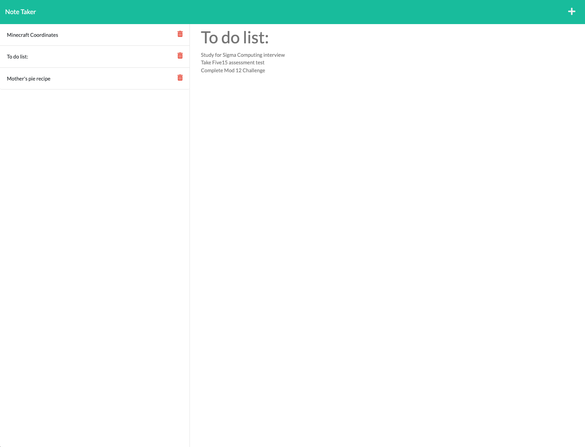

# Project Name - change to the name of your project

## Table of contents

- [Overview](#overview)
  - [The challenge](#the-challenge)
  - [User Story](#user-story)
  - [Acceptance Criteria](#acceptance-criteria)
  - [Screenshot](#screenshot)
  - [Links](#links)
- [My process](#my-process)
  - [Built with](#built-with)
  - [What I learned](#what-i-learned)
  - [Continued development](#continued-development)
  - [Useful resources](#useful-resources)
- [Author](#author)
- [Acknowledgments](#acknowledgments)

## Overview

### The challenge

The challenge of this assignment is to create a back-end server for the given front-end code of a note taking app so that the application can perform GET, POST and DELETE requests.

### User Story

AS A small business owner  
I WANT to be able to write and save notes  
SO THAT I can organize my thoughts and keep track of tasks I need to complete  

### Acceptance Criteria

GIVEN a note-taking application  
WHEN I open the Note Taker  
THEN I am presented with a landing page with a link to a notes page  
WHEN I click on the link to the notes page  
THEN I am presented with a page with existing notes listed in the left-hand column, plus empty fields to enter a new note title and the note’s text in the right-hand column  
WHEN I enter a new note title and the note’s text  
THEN a Save icon appears in the navigation at the top of the page  
WHEN I click on the Save icon  
THEN the new note I have entered is saved and appears in the left-hand column with the other existing notes  
WHEN I click on an existing note in the list in the left-hand column  
THEN that note appears in the right-hand column  
WHEN I click on the Write icon in the navigation at the top of the page  
THEN I am presented with empty fields to enter a new note title and the note’s text in the right-hand column  

### Screenshot

### Links

- Solution URL: [Github Repository](https://github.com/ayeh6/Note-Taker)
- Live Site URL: [Live Link](https://yeh-note-taker.herokuapp.com/)

## My process

### Built with

- HTML5
- CSS
- Javascript
- Node
- Express

### What I learned

Biggest thing I learned is how to create routes and how it modularizes then code. This simplifies the server.js code from instead of needing multiple lines for different get requests, it just takes one line. But that also requires making multiple files and directories for each path.

Also to make the code more modular, I separated the GET, POST, DELETE request functions to a separate controller file in its own directory. This makes the routes folder and files just for routing, while the controller files have the functionality and pass that functionality to the routes.

As for the GET, POST, and DELETE requests, it was just a lot of using fs for reading files and writing files since the application uses a JSON file for its database.

### Continued development

As for continued development, I would like to implement a PATCH request to update a note, this would probably require some work on the front-end such as making the selected note become a text-entry where the input is the note already inside, or have an edit button to make the note a text entry. Then a PATCH request would be made to update the note at that certain id.

### Useful resources

- [MDN](https://developer.mozilla.org/en-US/) - MDN helped a bit to refresh my memory on certain javascript concepts such as destructuring and array manipulation functions.

## Author

- Website - [Andrew Yeh](https://ayeh6.github.io/Yeh-Andrew-Portfolio-Website/)
- LinkedIn - [/in/ayeh6](https://www.linkedin.com/in/ayeh6/)

## Acknowledgments

I would like to acknowledge Manny for having great code the past few weeks when teaching these concepts using mini-projects. Having all that code on slack and github helped me understand how the server works and how Express works.